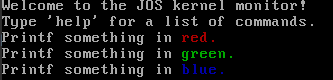

# Report for lab1

Hongyu Wen, 1800013069

> All Challenges **completed**


## Grade

```
running JOS: (1.1s) 
  printf: OK 
  backtrace count: OK 
  backtrace arguments: OK 
  backtrace symbols: OK 
  backtrace lines: OK 
Score: 50/50
```


## Environment Configuration

```
Hardware Environment:
Memory:         16GB
Processor:      Intel(R) Core(TM) i7-7700HQ CPU @ 2.80GHz
Graphics:       GeForce GTX 1060 Mobile
OS Type:        64 bit
Disk:           512GB

Software Environment:
OS:             Ubuntu 20.04.1 LTS
Gcc:            Gcc 9.3.0
Make:           GNU Make 4.2.1
Gdb:            GNU gdb 9.2

```

### Test Compiler Toolchain
```shell
$ objdump -i   # the 5th line say elf32-i386
$ gcc -m32 -print-libgcc-file-name
/usr/lib/gcc/x86_64-linux-gnu/5/32/libgcc.a
```

### QEMU Emulator
```shell
 # Clone the IAP 6.828 QEMU git repository
 $ git clone https://github.com/geofft/qemu.git -b 6.828-1.7.0
 $ cd qemu
 $ ./configure --disable-kvm --target-list="i386-softmmu x86_64-softmmu"
 $ make
 $ sudo make install
```


## PC Bootstrap

### Simulating the x86
```shell
houmin@cosmos:~/lab$ make
+ as kern/entry.S
+ cc kern/entrypgdir.c
+ cc kern/init.c
+ cc kern/console.c
+ cc kern/monitor.c
+ cc kern/printf.c
+ cc kern/kdebug.c
+ cc lib/printfmt.c
+ cc lib/readline.c
+ cc lib/string.c
+ ld obj/kern/kernel
+ as boot/boot.S
+ cc -Os boot/main.c
+ ld boot/boot
boot block is 390 bytes (max 510)
+ mk obj/kern/kernel.img
```
After compiling, we now have our boot loader(`obj/boot/boot`) and out kernel(`obj/kern/kernel`), So where is the disk?
Actually the `kernel.img` is the disk image, which is acting as the virtual disk here. From `kern/Makefrag` we can see that
both our boot loader and kernel have been written to the image(using the `dd` command).

Now we can running the QEMU like running a real PC.
```shell
houmin@cosmos:~/lab$ make qemu
sed "s/localhost:1234/localhost:26000/" < .gdbinit.tmpl > .gdbinit
qemu -hda obj/kern/kernel.img -serial mon:stdio -gdb tcp::26000 -D qemu.log
WARNING: Image format was not specified for 'obj/kern/kernel.img' and probing guessed raw.
         Automatically detecting the format is dangerous for raw images, write operations on block 0 will be restricted.
         Specify the 'raw' format explicitly to remove the restrictions.
6828 decimal is XXX octal!
entering test_backtrace 5
entering test_backtrace 4
entering test_backtrace 3
entering test_backtrace 2
entering test_backtrace 1
entering test_backtrace 0
leaving test_backtrace 0
leaving test_backtrace 1
leaving test_backtrace 2
leaving test_backtrace 3
leaving test_backtrace 4
leaving test_backtrace 5
Welcome to the JOS kernel monitor!
Type 'help' for a list of commands.
K>
```


#### Exercise 2
> Use GDB's si (Step Instruction) command to trace into the ROM BIOS for a few more instructions, and try to guess what it might be doing. You might want to look at Phil Storrs I/O Ports Description, as well as other materials on the 6.828 reference materials page. No need to figure out all the details - just the general idea of what the BIOS is doing first.

The first instruction is 

```asm
ljmp $0xf000, $0xe05b 
```
and PC jump to `$0xe05b`. (Note that BIOS was run in real mode.)

```asm
0xfe05b: cmpl $0x0, $cs:0x6ac8
0xfe062:  jne  0xfd2e1
```
If value at `$cs:0x6ac8` is not 0, jump to `$0xfd2e1`.

```asm
0xfe066:  xor  %dx, %dx
0xfe068:  mov  %dx %ss
0xfe06a:  mov  $0x7000, %esp
0xfe070:  mov  $0xf34d2, %edx
0xfe076:  jmp  0xfd15c
0xfd15c:  mov  %eax, %ecx
```
Jump to `0xfd15c` and set initial value of some registers.

```asm
cli
```
External interrupts disabled at the end of the cli instruction or from that point on until the interrupt flag is set.

```asm
cld
```
Clears the direction flag: DF = 0.


```asm
0xfd161:  mov  $0x8f, %eax
0xfd167:  out  %al, $0x70
0xfd169:  in  $0x71, %al
```
**`in %al PortAddr`: Input byte from I/O port `PortAddr` into `%al`. **
**`out PortAddr %al`: Output byte in `%al`to I/O port `PortAddr`. **

The ports `0x70` and `0x71` are corresponding to CMOS. Set `$0x70` to $0x8f$, which disables NMI.

```asm
0xfd16b:  in  $0x92, %al
0xfd16d:  or  $0x2, %al
0xfd16f:  out  %al, $0x92
```
The ports `0x92` are corresponding to PS/2 system control port A. Set bit 1 = 1 indicates A20 active.


## The Boot Loader

#### Exercise 3
> Take a look at the lab tools guide, especially the section on GDB commands. Even if you're familiar with GDB, this includes some esoteric GDB commands that are useful for OS work.
> Set a breakpoint at address `0x7c00`, which is where the boot sector will be loaded. Continue execution until that breakpoint. Trace through the code in `boot/boot.S`, using the source code and the disassembly file `obj/boot/boot.asm` to keep track of where you are. Also use the x/i command in GDB to disassemble sequences of instructions in the boot loader, and compare the original boot loader source code with both the disassembly in `obj/boot/boot.asm` and GDB.

At first, let's read `boot.S`.


```asm
seta20.1:
  inb     $0x64,%al               # Wait for not busy
  testb   $0x2,%al
  jnz     seta20.1

  movb    $0xd1,%al               # 0xd1 -> port 0x64
  outb    %al,$0x64
```
The port `0x64` is corresponding to KB controller. bit 1 = 1 means input buffer full. So we wait until bit 1 = 0 and send `0xd1` to KB controller, which means next byte written to 0060 will be written to the 804x output port. The original IBM AT and many compatibles use bit 1 of the output port to control the A20 gate.

```asm
seta20.2:
  inb     $0x64,%al               # Wait for not busy
  testb   $0x2,%al
  jnz     seta20.2

  movb    $0xdf,%al               # 0xdf -> port 0x60
  outb    %al,$0x60
```
The `0xdf` means to enable address line A20.


```asm
 lgdt    gdtdesc
```
 Load lgdt register.

```asm
movl    %cr0, %eax
orl     $CR0_PE_ON, %eax
movl    %eax, %cr0
ljmp    $PROT_MODE_CSEG, $protcseg
```
Set bit 0 of CR0 register to 1, which means switching to protected mode.

```asm
  .code32                     # Assemble for 32-bit mode
protcseg:
  # Set up the protected-mode data segment registers
  movw    $PROT_MODE_DSEG, %ax    # Our data segment selector
  movw    %ax, %ds                # -> DS: Data Segment
  movw    %ax, %es                # -> ES: Extra Segment
  movw    %ax, %fs                # -> FS
  movw    %ax, %gs                # -> GS
  movw    %ax, %ss                # -> SS: Stack Segment
  
  # Set up the stack pointer and call into C.
  movl    $start, %esp
  call bootmain
```

Now we move to `main.c`.

```c
readseg((uint32_t) ELFHDR, SECTSIZE*8, 0);
if (ELFHDR->e_magic != ELF_MAGIC)
		goto bad;
```
Read ELF head.


```C
ph = (struct Proghdr *) ((uint8_t *) ELFHDR + ELFHDR->e_phoff);
eph = ph + ELFHDR->e_phnum;
```
`ph`, `eph` are beginning, ending of program header table, respectively.


```C
for (; ph < eph; ph++)
// p_pa is the load address of this segment (as well
// as the physical address)
  readseg(ph->p_pa, ph->p_memsz, ph->p_offset);
```
Load the kernel.

```C
((void (*)(void)) (ELFHDR->e_entry))();
```
Run the kernel.


> Trace into bootmain() in boot/main.c, and then into readsect(). Identify the exact assembly instructions that correspond to each of the statements in readsect(). Trace through the rest of readsect() and back out into bootmain(), and identify the begin and end of the for loop that reads the remaining sectors of the kernel from the disk. Find out what code will run when the loop is finished, set a breakpoint there, and continue to that breakpoint. Then step through the remainder of the boot loader.

```asm
00007cdc <readseg>:
{
    7cdc:	55                   	push   %ebp
    7cdd:	89 e5                	mov    %esp,%ebp
    7cdf:	57                   	push   %edi
    7ce0:	56                   	push   %esi
	offset = (offset / SECTSIZE) + 1;
    7ce1:	8b 7d 10             	mov    0x10(%ebp),%edi
{
    7ce4:	53                   	push   %ebx
	end_pa = pa + count;
    7ce5:	8b 75 0c             	mov    0xc(%ebp),%esi
{
    7ce8:	8b 5d 08             	mov    0x8(%ebp),%ebx
	offset = (offset / SECTSIZE) + 1;
    7ceb:	c1 ef 09             	shr    $0x9,%edi
	end_pa = pa + count;
    7cee:	01 de                	add    %ebx,%esi
	offset = (offset / SECTSIZE) + 1;
    7cf0:	47                   	inc    %edi
	pa &= ~(SECTSIZE - 1);
    7cf1:	81 e3 00 fe ff ff    	and    $0xfffffe00,%ebx
	while (pa < end_pa) {
    7cf7:	39 f3                	cmp    %esi,%ebx
    7cf9:	73 12                	jae    7d0d <readseg+0x31>
		readsect((uint8_t*) pa, offset);
    7cfb:	57                   	push   %edi
    7cfc:	53                   	push   %ebx
		offset++;
    7cfd:	47                   	inc    %edi
		pa += SECTSIZE;
    7cfe:	81 c3 00 02 00 00    	add    $0x200,%ebx
		readsect((uint8_t*) pa, offset);
    7d04:	e8 73 ff ff ff       	call   7c7c <readsect>
		offset++;
    7d09:	58                   	pop    %eax
    7d0a:	5a                   	pop    %edx
    7d0b:	eb ea                	jmp    7cf7 <readseg+0x1b>
}
    7d0d:	8d 65 f4             	lea    -0xc(%ebp),%esp
    7d10:	5b                   	pop    %ebx
    7d11:	5e                   	pop    %esi
    7d12:	5f                   	pop    %edi
    7d13:	5d                   	pop    %ebp
    7d14:	c3                   	ret    
```

> At what point does the processor start executing 32-bit code? What exactly causes the switch from 16- to 32-bit mode?

The instruction `ljmp $PROT_MODE_CSEG, $protcseg` causes the switch from 16- to 32-bit mode in the boot.S.

> What is the last instruction of the boot loader executed, and what is the first instruction of the kernel it just loaded?

The last instruction is 
```asm
0x7d6b:    call   *0x10018
```
which corresponding to
```c
((void (*)(void)) (ELFHDR->e_entry))();
```
in `main.c`.

Set a breakpoint at pc `0x7d6b` (the last instruction of the boot loader) and step:
```asm
=> 0x10000c:	movw   $0x1234,0x472
0x0010000c in ?? ()
```
which is the first instruction of the kernel.

> Where is the first instruction of the kernel?

As we have mentioned, the first instruction of the kernel is at `0x0010000c`.

> How does the boot loader decide how many sectors it must read in order to fetch the entire kernel from disk? Where does it find this information?

The boot loader read the **program header** to decide it, which in **the ELF head**.

### Loading the Kernel

Examine the full list of the names, sizes, and link addresses of all the sections in the kernel executable by typing:

```shell
> objdump -h obj/kern/kernel
kernel:     file format elf32-i386

Sections:
Idx Name          Size      VMA       LMA       File off  Algn
  0 .text         000019e9  f0100000  00100000  00001000  2**4
                  CONTENTS, ALLOC, LOAD, READONLY, CODE
  1 .rodata       000006c0  f0101a00  00101a00  00002a00  2**5
                  CONTENTS, ALLOC, LOAD, READONLY, DATA
  2 .stab         00003b95  f01020c0  001020c0  000030c0  2**2
                  CONTENTS, ALLOC, LOAD, READONLY, DATA
  3 .stabstr      00001948  f0105c55  00105c55  00006c55  2**0
                  CONTENTS, ALLOC, LOAD, READONLY, DATA
  4 .data         00009300  f0108000  00108000  00009000  2**12
                  CONTENTS, ALLOC, LOAD, DATA
  5 .got          00000008  f0111300  00111300  00012300  2**2
                  CONTENTS, ALLOC, LOAD, DATA
  6 .got.plt      0000000c  f0111308  00111308  00012308  2**2
                  CONTENTS, ALLOC, LOAD, DATA
  7 .data.rel.local 00001000  f0112000  00112000  00013000  2**12
                  CONTENTS, ALLOC, LOAD, DATA
  8 .data.rel.ro.local 00000044  f0113000  00113000  00014000  2**2
                  CONTENTS, ALLOC, LOAD, DATA
  9 .bss          00000648  f0113060  00113060  00014060  2**5
                  CONTENTS, ALLOC, LOAD, DATA
 10 .comment      00000029  00000000  00000000  000146a8  2**0
                  CONTENTS, READONLY
```

The boot loader uses the ELF program headers to decide how to load the sections. The program headers specify which parts of the ELF object to load into memory and the destination address each should occupy. You can inspect the program headers by typing:
```shell
> objdump -x obj/kern/kernel
Program Header:
    LOAD off    0x00001000 vaddr 0xf0100000 paddr 0x00100000 align 2**12
         filesz 0x0000759d memsz 0x0000759d flags r-x
    LOAD off    0x00009000 vaddr 0xf0108000 paddr 0x00108000 align 2**12
         filesz 0x0000b6a8 memsz 0x0000b6a8 flags rw-
   STACK off    0x00000000 vaddr 0x00000000 paddr 0x00000000 align 2**4
         filesz 0x00000000 memsz 0x00000000 flags rwx
```

#### Exercise 5
>  Trace through the first few instructions of the boot loader again and identify the first instruction that would "break" or otherwise do the wrong thing if you were to get the boot loader's link address wrong. Then change the link address in `boot/Makefrag` to something wrong, run make clean, recompile the lab with make, and trace into the boot loader again to see what happens. Don't forget to change the link address back and make clean again afterward!

We know that BIOS load boot loader at `0x7C00`. 
```shell
> make clean 
rm -rf obj .gdbinit jos.in qemu.log
```
Open `boot/Makefrag` and we can see
```
$(OBJDIR)/boot/boot: $(BOOT_OBJS)
	@echo + ld boot/boot
	$(V)$(LD) $(LDFLAGS) -N -e start -Ttext 0x7C00 -o $@.out $^
	$(V)$(OBJDUMP) -S $@.out >$@.asm
	$(V)$(OBJCOPY) -S -O binary -j .text $@.out $@
	$(V)perl boot/sign.pl $(OBJDIR)/boot/boot
```
We change `0x7C00` to `0x7D00`.

```shell
> make
> make qemu-gdb
> make gdb
```
Make breakpoint at `0x7c00`. Trace through the first few instructions and we can see
```asm
 0x7c1e:	lgdtw  0x7d64
```
which used to be
```asm
 0x7c1e:	lgdtw  0x7c64
```
GDTR read wrong values. Type `continue` in gdb and we get
```
Program received signal SIGTRAP, Trace/breakpoint trap.
[   0:7c2d] => 0x7c2d:	ljmp   $0x8,$0x7d32
0x00007c2d in ?? ()
```
which used to be
```asm
ljmp   $0x8,$0x7c32
```

In Qemu, we get
```
Triple fault.  Halting for inspection via QEMU monitor.
```


Besides the section information, there is one more field in the ELF header that is important to us, named e_entry. This field holds the link address of the entry point in the program: the memory address in the program's text section at which the program should begin executing. You can see the entry point:

```shell
> objdump -f obj/kern/kernel
obj/kern/kernel:     file format elf32-i386
architecture: i386, flags 0x00000112:
EXEC_P, HAS_SYMS, D_PAGED
start address 0x0010000c

```


#### Exercise 6
> We can examine memory using GDB's x command. The GDB manual has full details, but for now, it is enough to know that the command x/Nx ADDR prints N words of memory at ADDR. (Note that both 'x's in the command are lowercase.) Warning: The size of a word is not a universal standard. In GNU assembly, a word is two bytes (the 'w' in xorw, which stands for word, means 2 bytes).

> Reset the machine (exit QEMU/GDB and start them again). Examine the 8 words of memory at `0x00100000` at the point the BIOS enters the boot loader, and then again at the point the boot loader enters the kernel. Why are they different? What is there at the second breakpoint? (You do not really need to use QEMU to answer this question. Just think.)


Examine the 8 words of memory at `0x00100000` at the point the BIOS enters the boot loader:
```gdb
(gdb) x/8x 0x100000
0x100000:	0x00000000	0x00000000	0x00000000	0x00000000
0x100010:	0x00000000	0x00000000	0x00000000	0x00000000
```

Examine the 8 words of memory at `0x00100000` at the point the boot loader enters the kernel:

```gdb
(gdb) x/8x 0x100000
0x100000:	0x1badb002	0x00000000	0xe4524ffe	0x7205c766
0x100010:	0x34000004	0x2000b812	0x220f0011	0xc0200fd8
```

They are different because boot loader load kernel at `$0x100000`. There is the `.text` section because the entry point is `$0x10000c`.


## The Kernel

### Using virtual memory to work around position dependence

#### Exercise 7
>  Use QEMU and GDB to trace into the JOS kernel and stop at the `movl %eax, %cr0`. Examine memory at `0x00100000` and at `0xf0100000`.

```gdb
(gdb) x/4b 0x00100000
0x100000:	0x02	0xb0	0xad	0x1b
(gdb) x/4b 0xf0100000
0xf0100000 <_start+4026531828>:	0x00	0x00	0x00	0x00
```

> Now, single step over that instruction using the stepi GDB command. Again, examine memory at `0x00100000` and at `0xf0100000`. Make sure you understand what just happened.

```gdb
(gdb) x/4b 0x00100000
0x100000:	0x02	0xb0	0xad	0x1b
(gdb) x/4b 0xf0100000
0xf0100000 <_start+4026531828>:	0x02	0xb0	0xad	0x1b
```
Paging enabled. Two virtual addresses `0x00100000` and `0xf0100000` correspond to a same physical address.


> What is the first instruction after the new mapping is established that would fail to work properly if the mapping weren't in place? Comment out the `movl %eax, %cr0` in `kern/entry.S`, trace into it, and see if you were right.

```gdb
(gdb) 
=> 0x10002a:	jmp    *%eax
0x0010002a in ?? ()
(gdb) 
=> 0xf010002c <relocated>:	add    %al,(%eax)
relocated () at kern/entry.S:74
74		movl	$0x0,%ebp			# nuke frame pointer
(gdb) 
Remote connection closed
```

We get error message in qemu:
```
qemu: fatal: Trying to execute code outside RAM or ROM at 0xf010002c
```


Now we turn to read through `kern/printf.c`, `lib/printfmt.c`, and `kern/console.c`. Read `kern/console.c` at first.

```c
// `High'-level console I/O.  Used by readline and cprintf.
void
cputchar(int c)
{
    cons_putc(c);
}

// output a character to the console
static void
cons_putc(int c)
{
    serial_putc(c);
    lpt_putc(c);
    cga_putc(c);
```
Then we turn to `printfmt.c` and pay attention to function `vprintfmt`.

```c
void vprintfmt(void (*putch)(int, void*), void *putdat, const char *fmt, va_list ap);
```

- `void (*putch)(int, void*)`: `int` and `void*` correspond to the value of output character and address.
- `void *putdat`: equal to `void*` mentioned before.
- `const char *fmt`: the format string.
- `va_list ap`: the arguments.


```c
	while ((ch = *(unsigned char *) fmt++) != '%') {
			if (ch == '\0')
				return;
			putch(ch, putdat);
		}
```
Directly output the string before `%`. Then parse the format.


#### Exercise 8

> We have omitted a small fragment of code - the code necessary to print octal numbers using patterns of the form "%o". Find and fill in this code fragment.


```c
case 'o':
    // Replace this with your code.
    /* putch('X', putdat); */
    /* putch('X', putdat); */
    /* putch('X', putdat); */
    /* break; */
    num = getuint(&ap, lflag);
    base = 8;
    goto number;
```

> Explain the interface between `printf.c` and `console.c`. Specifically, what function does `console.c` export? How is this function used by `printf.c`?

`console.c` exports `cputchar`, `getchar` and  `iscons`.
`cputchar` is used as a parameter when `printf.c` calls `vprintfmt`.

> Explain the following from `console.c`:
```c
if (crt_pos >= CRT_SIZE) {
    int i;
    memmove(crt_buf, crt_buf + CRT_COLS, (CRT_SIZE - CRT_COLS) * sizeof(uint16_t));
    for (i = CRT_SIZE - CRT_COLS; i < CRT_SIZE; i++)
            crt_buf[i] = 0x0700 | ' ';
            crt_pos -= CRT_COLS;
}
```

The function `cga_putc` define a buffer to cga displayer. When the screen is full ( `>= CRT_SIZE` ), scroll down one row to show newer infomation.

> For the following questions you might wish to consult the notes for Lecture 2. These notes cover GCC's calling convention on the x86. Trace the execution of the following code step-by-step:
```c
int x = 1, y = 3, z = 4;
cprintf("x %d, y %x, z %d\n", x, y, z);
```

We modify `kern/monitor.c`.
```c
void
monitor(struct Trapframe *tf)
{
	char *buf;

	cprintf("Welcome to the JOS kernel monitor!\n");
	cprintf("Type 'help' for a list of commands.\n");

	// insert
	int x = 1, y = 3, z = 4;
	cprintf("x %d, y %x, z %d\n", x, y, z);

	while (1) {
		buf = readline("K> ");
		if (buf != NULL)
			if (runcmd(buf, tf) < 0)
				break;
	}
}
```

> In the call to `cprintf()`, to what does fmt point? To what does ap point?
fmt points to `"x %d, y %x, z %d\n"`, and ap points to these arguments.

> List (in order of execution) each call to cons_putc, va_arg, and vcprintf. For cons_putc, list its argument as well. For va_arg, list what ap points to before and after the call. For vcprintf list the values of its two arguments.

Using gdb, make breakpoint at `cons_putc`, `vcprintf` and make watchpoint at `ap`, we have
```
cprintf (fmt=0xf0101ad2 "x %d, y %x, z %d\n") 
vcprintf (fmt=0xf0101ad2 "x %d, y %x, z %d\n", ap=0xf0115f64 "\001")
cons_putc (c=120)
cons_putc (c=32)
va_arg(*ap, int)
Hardware watchpoint 4: ap
Old value = 0xf0115f64 "\001"
New value = 0xf0115f68 "\003"
cons_putc (c=49)
cons_putc (c=44)
cons_putc (c=32)
cons_putc (c=121)
cons_putc (c=32)
va_arg(*ap, int)
Hardware watchpoint 4: ap
Old value = 0xf0115f68 "\003"
New value = 0xf0115f6c "\004"
cons_putc (c=51)
cons_putc (c=44)
cons_putc (c=32)
cons_putc (c=122)
cons_putc (c=32)
va_arg(*ap, int)
Hardware watchpoint 4: ap
Old value = 0xf0115f6c "\004"
New value = 0xf0115f70 "T\034\020?\214_\021??\027\020??_\021??\027\020?_\021?_\021?" 
cons_putc (c=52)
cons_putc (c=10)
```

> Run the following code.
```c
unsigned int i = 0x00646c72;
cprintf("H%x Wo%s", 57616, &i);
```
> What is the output? Explain how this output is arrived at in the step-by-step manner of the previous exercise.

The output is "He110 World". 57616 = 0xe110, thus `"H%x"` transfer to `He110`. `i = 0x00646c72` is treated as a string, so it will be printed as 'r'=(char)0x72 'l'=(char)0x6c 'd'=(char)0x64, and 0x00 is treated as a mark of end of string.

> The output depends on that fact that the x86 is little-endian. If the x86 were instead big-endian what would you set i to in order to yield the same output? Would you need to change 57616 to a different value?

We need to set i to `0x726c6400`. Do not need to change 57616.

> In the following code, what is going to be printed after 'y='? (note: the answer is not a specific value.) Why does this happen?
```c
cprintf("x=%d y=%d", 3);
```
We are not sure about the output after `"y="` since the content in memory after `3` can be arbitrary.

> Let's say that GCC changed its calling convention so that it pushed arguments on the stack in declaration order, so that the last argument is pushed last. How would you have to change cprintf or its interface so that it would still be possible to pass it a variable number of arguments?

Add another argument after the variable arguments to indicate the length of arguments.


#### Challenge
> Enhance the console to allow text to be printed in different colors. The traditional way to do this is to make it interpret ANSI escape sequences embedded in the text strings printed to the console, but you may use any mechanism you like. There is plenty of information on the 6.828 reference page and elsewhere on the web on programming the VGA display hardware. If you're feeling really adventurous, you could try switching the VGA hardware into a graphics mode and making the console draw text onto the graphical frame buffer.


In `kern/console.c` we find
```c
static void
cga_putc(int c)
{
	// if no attribute given, then use black on white
	if (!(c & ~0xFF))
		c |= 0x0700;
```

Add `color.h` in `inc/`.
```h
#define COLOR_BLUE 0x0100
#define COLOR_GREEN 0x0200
#define COLOR_RED 0x0400
#define COLOR_WHITE 0x0700

int color;
```

In `lib/printfmt.c` 
```c
#include <inc/color.h>

...

               // change color
		case 'C':
			num = getint(&ap, lflag);
			color = num;
			break;
```

In `kern/console.c`
```c
int color = COLOR_WHITE;

static void
cga_putc(int c)
{
	// if no attribute given, then use black on white
	if (!(c & ~0xFF))
		c |= color;

	switch (c & 0xff) {
	case '\b':
		if (crt_pos > 0) {
			crt_pos--;
			crt_buf[crt_pos] = (c & ~0xff) | ' ';
		}
		break;
	case '\n':
		crt_pos += CRT_COLS;
		color = COLOR_WHITE; // reset color
		/* fallthru */
	...
}
```

In `kernel/monitor.c`
```c
void
monitor(struct Trapframe *tf)
{
	char *buf;

	cprintf("Welcome to the JOS kernel monitor!\n");
	cprintf("Type 'help' for a list of commands.\n");
	cprintf("Printf something in %Cred.\n", COLOR_RED);
	cprintf("Printf something in %Cgreen.\n", COLOR_GREEN);
	cprintf("Printf something in %Cblue.\n", COLOR_BLUE);
	...
}
```
Make qemu:



### The Stack

#### Exercise 9

> Determine where the kernel initializes its stack. 

`%esp`, `%ebp` are not changed until jump to `kern/entry.S`. Hence let's turn to `entry.S` and find
```asm
relocated:

	# Clear the frame pointer register (EBP)
	# so that once we get into debugging C code,
	# stack backtraces will be terminated properly.
	movl	$0x0,%ebp			# nuke frame pointer

	# Set the stack pointer
	movl	$(bootstacktop),%esp

	# now to C code
	call	i386_init
```

> Determine exactly where in memory its stack is located. 
In `inc/mmu.h`:
```h
#define PGSIZE		4096
```

In `inc/memlayout.h`:
```h
#define KSTKSIZE	(8*PGSIZE)   		// size of a kernel stack
```

In `obj/kern/kernel.sym`:
```sym
f0110000 D bootstacktop
```

In `entry.S`:
```asm
	.p2align	PGSHIFT		# force page alignment
	.globl		bootstack
bootstack:
	.space		KSTKSIZE
	.globl		bootstacktop   
bootstacktop:
```
Trace the kernel we have
```gdb
 0xf0100034 <relocated+5>:	mov    $0xf0110000,%esp
relocated () at kern/entry.S:77
77		movl	$(bootstacktop),%esp
```

Therefore, we concluded the stack at virtual address `0xf0108000` - `0xf0110000`, physical address `0x00108000` - `0x00110000`.

> How does the kernel reserve space for its stack? And at which "end" of this reserved area is the stack pointer initialized to point to?

As we mentioned before, the kernel reserve space in `entry.S`. The stack pointer point to `bootstacktop`, i.e., `0xf0110000`.


#### Exercise 10

> To become familiar with the C calling conventions on the x86, find the address of the test_backtrace function in obj/kern/kernel.asm, set a breakpoint there, and examine what happens each time it gets called after the kernel starts. How many 32-bit words does each recursive nesting level of test_backtrace push on the stack, and what are those words?
> Note that, for this exercise to work properly, you should be using the patched version of QEMU available on the tools page or on Athena. Otherwise, you'll have to manually translate all breakpoint and memory addresses to linear addresses.

In `kern/init.c`
```c
void
test_backtrace(int x)
{
	cprintf("entering test_backtrace %d\n", x);
	if (x > 0)
		test_backtrace(x-1);
	else
		mon_backtrace(0, 0, 0);
	cprintf("leaving test_backtrace %d\n", x);
}

void
i386_init(void)
{
        ...

	// Test the stack backtrace function (lab 1 only)
	test_backtrace(5);

	...
}
```

In `kern/monitor.c`:
```c
int
mon_backtrace(int argc, char **argv, struct Trapframe *tf)
{
	// Your code here.
	return 0;
}
```

Now we analyze `test_backtrace` in `kernel.asm`:
```asm
void
test_backtrace(int x)
{
f0100040:	55                   	push   %ebp 
# saves the previous function's base pointer
f0100041:	89 e5                	mov    %esp,%ebp
# set new stack pointer
f0100043:	56                   	push   %esi
f0100044:	53                   	push   %ebx
f0100045:	e8 72 01 00 00       	call   f01001bc <__x86.get_pc_thunk.bx>
f010004a:	81 c3 be 12 01 00    	add    $0x112be,%ebx
f0100050:	8b 75 08             	mov    0x8(%ebp),%esi
	cprintf("entering test_backtrace %d\n", x);
f0100053:	83 ec 08             	sub    $0x8,%esp
f0100056:	56                   	push   %esi
f0100057:	8d 83 18 07 ff ff    	lea    -0xf8e8(%ebx),%eax
f010005d:	50                   	push   %eax
f010005e:	e8 e6 09 00 00       	call   f0100a49 <cprintf>
# call cprintf
	if (x > 0)
f0100063:	83 c4 10             	add    $0x10,%esp
# update #esp
f0100066:	85 f6                	test   %esi,%esi
# test whether x > 0
f0100068:	7f 2b                	jg     f0100095 <test_backtrace+0x55>
# if so, call test_backtrace(x - 1)
		test_backtrace(x-1);
	else
		mon_backtrace(0, 0, 0);
f010006a:	83 ec 04             	sub    $0x4,%esp
f010006d:	6a 00                	push   $0x0
f010006f:	6a 00                	push   $0x0
f0100071:	6a 00                	push   $0x0
f0100073:	e8 0b 08 00 00       	call   f0100883 <mon_backtrace>
# else, call mon_backtrace
f0100078:	83 c4 10             	add    $0x10,%esp
	cprintf("leaving test_backtrace %d\n", x);
f010007b:	83 ec 08             	sub    $0x8,%esp
f010007e:	56                   	push   %esi
f010007f:	8d 83 34 07 ff ff    	lea    -0xf8cc(%ebx),%eax
f0100085:	50                   	push   %eax
f0100086:	e8 be 09 00 00       	call   f0100a49 <cprintf>
}
```

#### Exercise 11

```c
int
mon_backtrace(int argc, char **argv, struct Trapframe *tf)
{
	// Your code here.
	 cprintf("Stack backtrace:\n");
#define READ(x) *((uint32_t*) (x))

	uint32_t ebp = read_ebp();
	while (ebp) {
		cprintf("ebp %08x  eip %08x  args %08x %08x %08x %08x %08x\n",
			ebp,
			READ(ebp + 4),
			READ(ebp + 8),
			READ(ebp + 12),
			READ(ebp + 16),
			READ(ebp + 20),
			READ(ebp + 24));
		}
		ebp = READ(ebp);
	}
	return 0;
#undef READ
}
```

#### Exercise 12

```shell
> objdump -h obj/kern/kernel

obj/kern/kernel:     file format elf32-i386

Sections:
Idx Name          Size      VMA       LMA       File off  Algn
  0 .text         00001b29  f0100000  00100000  00001000  2**4
                  CONTENTS, ALLOC, LOAD, READONLY, CODE
  1 .rodata       00000718  f0101b40  00101b40  00002b40  2**5
                  CONTENTS, ALLOC, LOAD, READONLY, DATA
  2 .stab         00003d15  f0102258  00102258  00003258  2**2
                  CONTENTS, ALLOC, LOAD, READONLY, DATA
  3 .stabstr      00001981  f0105f6d  00105f6d  00006f6d  2**0
                  CONTENTS, ALLOC, LOAD, READONLY, DATA
  4 .data         00009300  f0108000  00108000  00009000  2**12
                  CONTENTS, ALLOC, LOAD, DATA
  5 .got          00000008  f0111300  00111300  00012300  2**2
                  CONTENTS, ALLOC, LOAD, DATA
  6 .got.plt      0000000c  f0111308  00111308  00012308  2**2
                  CONTENTS, ALLOC, LOAD, DATA
  7 .data.rel.local 00001000  f0112000  00112000  00013000  2**12
                  CONTENTS, ALLOC, LOAD, DATA
  8 .data.rel.ro.local 00000044  f0113000  00113000  00014000  2**2
                  CONTENTS, ALLOC, LOAD, DATA
  9 .bss          00000648  f0113060  00113060  00014060  2**5
                  CONTENTS, ALLOC, LOAD, DATA
 10 .comment      00000029  00000000  00000000  000146a8  2**0
                  CONTENTS, READONLY

> objdump -G obj/kern/kernel > kernel.stab
```


In `monitor.c`:
```c
int
mon_backtrace(int argc, char **argv, struct Trapframe *tf)
{
	// Your code here.
	 cprintf("Stack backtrace:\n");
#define READ(x) *((uint32_t*) (x))

	uint32_t ebp = read_ebp();
	uint32_t eip = 0;
	struct Eipdebuginfo info;
	while (ebp) {
		eip = READ(ebp + 4);
		cprintf("ebp %08x  eip %08x  args %08x %08x %08x %08x %08x\n",
			ebp,
			eip,
			READ(ebp + 8),
			READ(ebp + 12),
			READ(ebp + 16),
			READ(ebp + 20),
			READ(ebp + 24));

		if(!debuginfo_eip(eip, &info)) {
			cprintf("\t%s:%d: %.*s+%d\n",
				info.eip_file,
				info.eip_line,
				info.eip_fn_namelen, info.eip_fn_name,
				eip - info.eip_fn_addr);
		}
		ebp = READ(ebp);
	}
	return 0;
#undef READ
}
```

By searching the Internet, we found
```
68 - 0x44 - N_SLINE
Line number in text segment

.stabn N_SLINE, 0, desc, value
desc  -> line_number
value -> code_address (relocatable addr where the corresponding code starts)
For single source lines that generate discontiguous code, such as flow of control statements, there may be more than one N_SLINE stab for the same source line. In this case there is a stab at the start of each code range, each with the same line number.

```

In `kdebug.c`:
```c
stab_binsearch(stabs, &lline, &rline, N_SLINE, addr);
info->eip_line = stabs[lline].n_desc;
```