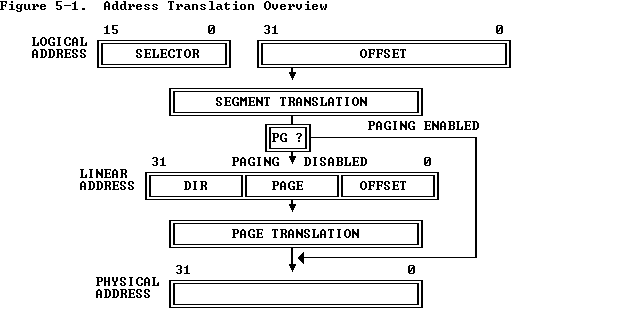

# Report for lab2

Hongyu Wen, 1800013069

> All exercises finished.
>
> All questions answered.
>
> Challenge 2 completed.


## Physical Page Management

### Exercise 1

In `pmap.c`, At first we see
```c
	kern_pgdir = (pde_t *) boot_alloc(PGSIZE);
	memset(kern_pgdir, 0, PGSIZE);
```
which allocates memory of PGSIZE for `kern_pgdir`.

Complete `boot_alloc`:
```c
result = nextfree;
nextfree = ROUNDUP(nextfree + n, PGSIZE);
if ((uint32_t)nextfree - KERNBASE > npages * PGSIZE) {
    panic("boot_alloc: Out of memory.");
}
return result;
```
In the next line we see
```c
kern_pgdir[PDX(UVPT)] = PADDR(kern_pgdir) | PTE_U | PTE_P;
```
which builds the first entry in `kern_pgdir`. Note that `PTE_U` and `PTE_P` are flags (defined in `inc/mmu.h`). The comments from `mmu.h` maybe are helpful.

```
A linear address 'la' has a three-part structure as follows:

+--------10------|-------10-------|---------12----------+
| Page Directory |   Page Table   | Offset within Page  |
|      Index     |      Index     |                     |
+----------------|----------------|---------------------+
 \--- PDX(la) --/ \--- PTX(la) --/ \---- PGOFF(la) ----/
 \---------- PGNUM(la) ----------/

The PDX, PTX, PGOFF, and PGNUM macros decompose linear addresses as shown.
To construct a linear address la from PDX(la), PTX(la), and PGOFF(la),
use PGADDR(PDX(la), PTX(la), PGOFF(la)).
```

Then we need to initialize the PageInfo array.
```c
pages = (struct PageInfo *) boot_alloc(npages * sizeof(struct PageInfo));
memset(pages, 0, npages * sizeof(struct PageInfo));
```

And we find the definition of `PageInfo`:

```c
struct PageInfo {
	// Next page on the free list.
	struct PageInfo *pp_link;

	// pp_ref is the count of pointers (usually in page table entries)
	// to this page, for pages allocated using page_alloc.
	// Pages allocated at boot time using pmap.c's
	// boot_alloc do not have valid reference count fields.

	uint16_t pp_ref;
};
```

Complete `page_init()`:
```c
	int num_boot_alloc = ((uint32_t)boot_alloc(0) - KERNBASE) / PGSIZE;
	int num_iohole = (EXTPHYSMEM - IOPHYSMEM) / PGSIZE;
	for (i = 0; i < npages; i++) {
		if (i == 0) {
			// reflect 1)
			pages[i].pp_ref = 1;
		} else if (i >= npages_basemem &&
			   i < npages_basemem + num_iohole + num_boot_alloc) {
			// reflect 3)
			pages[i].pp_ref = 1;
		} else {
			pages[i].pp_ref = 0;
			pages[i].pp_link = page_free_list;
			page_free_list = &pages[i];
		}
	}
```

Then run qemu and we get
```
check_page_free_list() succeeded!
```

Now we turn to `page_alloc()`.
```
	struct PageInfo * result;

	// out of free memory
	if (page_free_list == NULL) {
		return NULL;
	}

	result = page_free_list;
	page_free_list = result->pp_link;

	result->pp_link = NULL;
	if (alloc_flags & ALLOC_ZERO) {
		memset(page2kva(result), 0, PGSIZE);
	}
	return result;
```

Note that `page2kva` defined in `pmap.h`:
```h
static inline void*
page2kva(struct PageInfo *pp)
{
	return KADDR(page2pa(pp));
}


static inline struct PageInfo*
pa2page(physaddr_t pa)
{
	if (PGNUM(pa) >= npages)
		panic("pa2page called with invalid pa");
	return &pages[PGNUM(pa)];
}

/* This macro takes a physical address and returns the corresponding kernel
 * virtual address.  It panics if you pass an invalid physical address. */
#define KADDR(pa) _kaddr(__FILE__, __LINE__, pa)

static inline void*
_kaddr(const char *file, int line, physaddr_t pa)
{
	if (PGNUM(pa) >= npages)
		_panic(file, line, "KADDR called with invalid pa %08lx", pa);
	return (void *)(pa + KERNBASE);
}
```

Then we complete `page_free`:
```c
	if (pp->pp_ref != 0) {
		panic("page_free: pp_ref is nonzero!")
	}
	if (pp->pp_link != NULL) {
		panic("page_free: pp_link is not NULL!")
	}

	pp->pp_link = page_free_list;
	page_free_list = pp;
```

Run qemu and we receive
```
check_page_free_list() succeeded!
check_page_alloc() succeeded!
```

## Virtual Memory

### Exercise 2

#### Chapter 5



- The processor locates the GDT and the current LDT in memory by means of the GDTR and LDTR registers.
- The addressing mechanism uses the DIR field as an index into a page directory, uses the PAGE field as an index into the page table determined by the page directory, and uses the OFFSET field to address a byte within the page determined by the page table.
- The physical address of the current page directory is stored in the CPU register CR3, also called the page directory base register (PDBR).


### Exercise 3

```
$> make qemu
qemu-system-i386 -drive file=obj/kern/kernel.img,index=0,media=disk,format=raw -serial mon:stdio -gdb tcp::26000 -D qemu.log 
6828 decimal is 15254 octal!
Physical memory: 131072K available, base = 640K, extended = 130432K
check_page_free_list() succeeded!
check_page_alloc() succeeded!
kernel panic at kern/pmap.c:728: assertion failed: page_insert(kern_pgdir, pp1, 0x0, PTE_W) < 0
Welcome to the JOS kernel monitor!
Type 'help' for a list of commands.
Printf something in red.
Printf something in green.
Printf something in blue.
K> QEMU 2.3.0 monitor - type 'help' for more information
(qemu) info registers
EAX=ffffffff EBX=f011430c ECX=00000004 EDX=00000064
ESI=f0112f8c EDI=00000000 EBP=f0112e78 ESP=f0112e70
EIP=f0100550 EFL=00000046 [---Z-P-] CPL=0 II=0 A20=1
```

### Questions

1. The type of `x` is `uintptr_t` because we use `*` to dereference it. In order to translate a physical address into a virtual address that the kernel can actually read and write, the kernel must add `0xf0000000` to the physical address to find its corresponding virtual address in the remapped region. You should use `KADDR(pa)` to do that addition.


### Exercise 4

One need to carefully implement `page_insert` to avoid error when the same
// pp is re-inserted at the same virtual address in the same pgdir.

```
int
page_insert(pde_t *pgdir, struct PageInfo *pp, void *va, int perm)
{
	// Fill this function in
	pte_t *entry = pgdir_walk(pgdir, va, 1);

	if (entry == NULL) {
		return -E_NO_MEM;
	}

	pp->pp_ref += 1;
	// avoid to reach pp_ref = 0

	if (*entry & PTE_P) {
		tlb_invalidate(pgdir, va);
		page_remove(pgdir, va);
	}

	*entry = (page2pa(pp) | perm | PTE_P);
	/* pgdir[PDX(va)] |= perm; */

	return 0;
}
```

## Kernel Address Space


The comments  from `memlayout.h` may helps:
```
 * Virtual memory map:                                Permissions
 *                                                    kernel/user
 *
 *    4 Gig -------->  +------------------------------+
 *                     |                              | RW/--
 *                     ~~~~~~~~~~~~~~~~~~~~~~~~~~~~~~~~
 *                     :              .               :
 *                     :              .               :
 *                     :              .               :
 *                     |~~~~~~~~~~~~~~~~~~~~~~~~~~~~~~| RW/--
 *                     |                              | RW/--
 *                     |   Remapped Physical Memory   | RW/--
 *                     |                              | RW/--
 *    KERNBASE, ---->  +------------------------------+ 0xf0000000      --+
 *    KSTACKTOP        |     CPU0's Kernel Stack      | RW/--  KSTKSIZE   |
 *                     | - - - - - - - - - - - - - - -|                   |
 *                     |      Invalid Memory (*)      | --/--  KSTKGAP    |
 *                     +------------------------------+                   |
 *                     |     CPU1's Kernel Stack      | RW/--  KSTKSIZE   |
 *                     | - - - - - - - - - - - - - - -|                 PTSIZE
 *                     |      Invalid Memory (*)      | --/--  KSTKGAP    |
 *                     +------------------------------+                   |
 *                     :              .               :                   |
 *                     :              .               :                   |
 *    MMIOLIM ------>  +------------------------------+ 0xefc00000      --+
 *                     |       Memory-mapped I/O      | RW/--  PTSIZE
 * ULIM, MMIOBASE -->  +------------------------------+ 0xef800000
 *                     |  Cur. Page Table (User R-)   | R-/R-  PTSIZE
 *    UVPT      ---->  +------------------------------+ 0xef400000
 *                     |          RO PAGES            | R-/R-  PTSIZE
 *    UPAGES    ---->  +------------------------------+ 0xef000000
 *                     |           RO ENVS            | R-/R-  PTSIZE
 * UTOP,UENVS ------>  +------------------------------+ 0xeec00000
 * UXSTACKTOP -/       |     User Exception Stack     | RW/RW  PGSIZE
 *                     +------------------------------+ 0xeebff000
 *                     |       Empty Memory (*)       | --/--  PGSIZE
 *    USTACKTOP  --->  +------------------------------+ 0xeebfe000
 *                     |      Normal User Stack       | RW/RW  PGSIZE
 *                     +------------------------------+ 0xeebfd000
 *                     |                              |
 *                     |                              |
 *                     ~~~~~~~~~~~~~~~~~~~~~~~~~~~~~~~~
 *                     .                              .
 *                     .                              .
 *                     .                              .
 *                     |~~~~~~~~~~~~~~~~~~~~~~~~~~~~~~|
 *                     |     Program Data & Heap      |
 *    UTEXT -------->  +------------------------------+ 0x00800000
 *    PFTEMP ------->  |       Empty Memory (*)       |        PTSIZE
 *                     |                              |
 *    UTEMP -------->  +------------------------------+ 0x00400000      --+
 *                     |       Empty Memory (*)       |                   |
 *                     | - - - - - - - - - - - - - - -|                   |
 *                     |  User STAB Data (optional)   |                 PTSIZE
 *    USTABDATA ---->  +------------------------------+ 0x00200000        |
 *                     |       Empty Memory (*)       |                   |
 *    0 ------------>  +------------------------------+                 --+
 *
 * (*) Note: The kernel ensures that "Invalid Memory" is *never* mapped.
 *     "Empty Memory" is normally unmapped, but user programs may map pages
 *     there if desired.  JOS user programs map pages temporarily at UTEMP.
```

### Exercise 5

```c
boot_map_region(kern_pgdir, UPAGES, PTSIZE, PADDR(pages), PTE_U);
boot_map_region(kern_pgdir, KSTACKTOP - KSTKSIZE, PTSIZE, PADDR(bootstack), PTE_W);
boot_map_region(kern_pgdir, KERNBASE, 0x10000000, 0x0, PTE_W);
```
Comments: Why kernel sets up virtual memory? Because sometimes it need to visit memory by using physical address.


By now we have

```shell
running JOS: (1.0s) 
  Physical page allocator: OK 
  Page management: OK 
  Kernel page directory: OK 
  Page management 2: OK 
Score: 70/70
```


### Questions

2. | Entry | Base Virtual Address | Points to (logically)                      |
   | :---: | -------------------- | ------------------------------------------ |
   | 1023  | 0xffc00000           | Page table for top 4MB of phys memory      |
   | 1022  | 0xff800000           | Page table for top 8MB~4MB of phys memory  |
   |  960  | 0xf0000000           | Kernel                                     |
   |  959  | 0xefc00000           | CPU's kernel stack                         |
   |  956  | 0xef000000           | pages                                      |
   |   2   | 0x00800000           | Program Data & Heap                        |
   |   1   | 0x00400000           | Empty Memory                               |
   |   0   | 0x00000000           | Empty Memory and User STAB Data (optional) |

3. User can not read or write when `PTE_U = 0`.

4. The size of `pages` is 4MB and the size of `struct PageInfo` is 8B, which implys the system can support (4MB / 8B) * 4K = 2GB.

5. - `PageInfo`: 4MB
   - `page directory`: 4KB
   - `page table`: $2^{10}$ * 4KB = 4MB (there can be multiple virtual addr corresponding to one physical addr)
   - total: 8MB + 4KB
6. 
   After `jmp *%eax`. 
   It is possible because `entry_pgdir` also maps virtual addr [0, 4M) to physical addr [0, 4M).
   It is necessary because later a `kern_pgdir` will be loaded and virtual address [0, 4M) will be abandoned.
   (The 31th bit of `%cr0` implys whether paging is enabled. The `%cr3` saves the physical addr of page dictionary.)


### Challenge 2

At first we implement `showmappings`. In `monitor.h`:

```h
int showmappings(int argc, char **argv, struct Trapframe *tf);
```

In `monitor.c`:
```c
#include <kern/pmap.h>
...

static struct Command commands[] = {
        ...
	{ "showmappings", "Display in a useful and easy-to-read format all of the physical page mappings", showmappings }
};

...

int xtoi(char *buf) {
	uint32_t ret = 0;
	for (buf += 2; *buf; ++buf) {
		if (*buf >= 'a') {
			ret = ret * 16 + (*buf - 'a') + 10;
		} else {
			ret = ret * 16 + (*buf - '0');
		}
	}
	return ret;
} // string to int

int showmappings(int argc, char **argv, struct Trapframe *tf) {
	if (argc <= 1) {
		cprintf("showmappings usage: showmappings begin_addr end_addr");
		return 0;
	}

	uint32_t begin_addr = xtoi(argv[1]);
	uint32_t end_addr = xtoi(argv[2]);
	for (uint32_t now = begin_addr; now <= end_addr; now += PGSIZE) {
		pte_t *pte = pgdir_walk(kern_pgdir, (void *)now, 1);
		if (pte == NULL) {
			panic("Out of memory!");
		} else if (*pte & PTE_P) {
			cprintf("page %x: ");
			cprintf("Write=%d ", (bool)(*pte & PTE_W));
			cprintf("User=%d\n", (bool)(*pte & PTE_U));
		} else {
			cprintf("page %x does not exist.\n");
		}
	}
	return 0;
}

```

Run `make qemu`:
```shell
K> showmappings 0x3000 0x5000
page 3000 does not exist.
page 4000 does not exist.
page 5000 does not exist.
K> showmappings 0xf0111000 0xf0112000
showmappings 0xf0111000 0xf0112000
page f0111000: Write=1 User=0
page f0112000: Write=1 User=0
```

Then implement `set_perm` and `dump`:

```c
void pprint(pte_t *pte) {
        crpintf("Present=%d", (bool)(*pte & PTE_P));
	cprintf("Write=%d ", (bool)(*pte & PTE_W));
	cprintf("User=%d\n", (bool)(*pte & PTE_U));
}

int set_perm(int argc, char *argv, struct Trapframe *tf) {
	if (argc <= 1) {
		cprintf("set_perm usage: set_perm addr new_perm");
		return 0;
	}

	uint32_t addr = xtoi(argv[1]);
	uint32_t perm = btoi(argv[2]);
	uint32_t mask = PTE_P | PTE_U | PTE_W;
	pte_t *pte = pgdir_walk(kern_pgdir, (void *)addr, 1);

	if (pte == NULL) {
		panic("Out of memory!");
	} else {
		cprintf("Before change: ");
		pprint(pte);
		*pte &= ~mask;
		*pre |= perm;
		cprintf("After change: ");
		pprint(pte);
	}
	return 0;
}

int dump(int argc, char **argv, struct Trapframe *tf) {
	if (argc <= 3) {
		cprintf("dump usage: dump [V/P] begin_addr num_of_addr\n");
		return 0;
	}

	uint32_t begin_addr = xtoi(argv[2]);
	uint32_t end_addr = xtoi(argv[3]);
	if (*argv[1] == 'P') {
		begin_addr += KERNBASE;
		end_addr += KERNBASE;
	}

	for (; begin_addr <= end_addr; begin_addr += 1) {
		uint8_t * addr = (uint8_t *) begin_addr;
		cprintf("%x: %x\n", addr, *addr);
	}
	return 0;
}
```

Run `make qemu`:
```shell
K> dump V 0xf011c340 0xf011c345
dump V 0xf011c340 0xf011c345
f011c340: 38
f011c341: c3
f011c342: 11
f011c343: f0
f011c344: 0
f011c345: 0
```