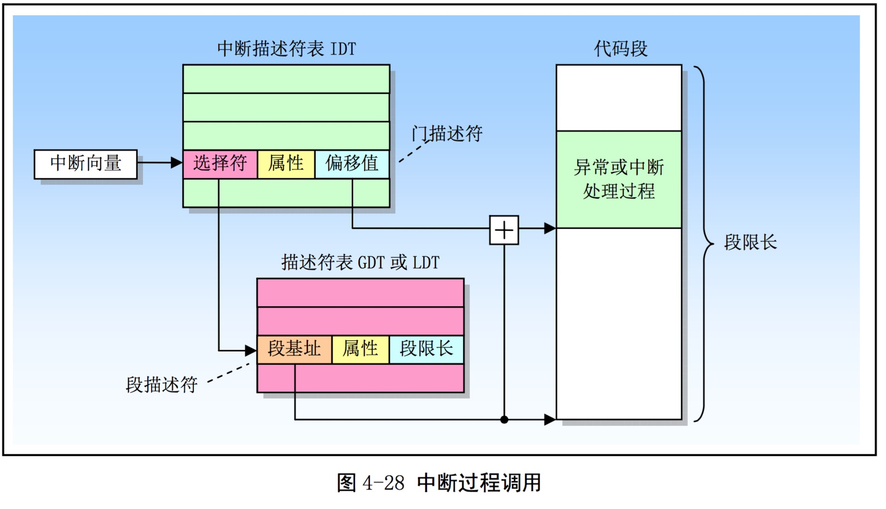

# Report for lab3

Hongyu Wen, 1800013069

> All exercises finished.
>
> All questions answered.
>
> Challenge 1 completed.

## Grade

```shell
divzero: OK (3.2s) 
softint: OK (2.4s) 
badsegment: OK (2.4s) 
Part A score: 30/30

faultread: OK (3.4s) 
faultreadkernel: OK (2.6s) 
faultwrite: OK (3.3s) 
faultwritekernel: OK (2.8s) 
breakpoint: OK (3.2s) 
testbss: OK (2.8s) 
hello: OK (3.3s) 
buggyhello: OK (2.6s) 
    (Old jos.out.buggyhello failure log removed)
buggyhello2: OK (3.3s) 
evilhello: OK (2.7s) 
Part B score: 50/50

Score: 80/80
```


At first, we need to fix the link script in `kern/kernel.ld`:
```ld
	.bss : {
		PROVIDE(edata = .);
		*(.dynbss)
		*(.bss .bss.*)
		*(COMMON)
		PROVIDE(end = .);
	}
```


## Part A: User Environments and Exception Handling

The envs in JOS is processes.

### Exercise 1

In  `pmap.c`:
```c
	envs = (struct Env *) boot_alloc(NENV * sizeof(struct Env));
	memset(envs, 0, NENV * sizeof(struct Env));
	...
	boot_map_region(kern_pgdir, UENVS, PTSIZE, PADDR(envs), PTE_U);
```


### Exercise 2


```c
void
env_init(void)
{
	env_free_list = NULL;
	for (int i = NENV - 1; ~i; --i) { 
	// Note that env_free_list points to env[0]
	// So we need to insert envs to env_free_list reversely.
	
		struct Env * now_env = envs + i;
		memset(now_env, 0, sizeof(struct Env));

		now_env->env_link = env_free_list;
		env_free_list = now_env;
	}
	...
}
```

```c
static int
env_setup_vm(struct Env *e)
{
        ...
	
	p->pp_ref += 1; // maintain page info
	e->env_pgdir = page2kva(p); 
	// get the kernel virtual address. 
	// Note that all this things is in the kernel space 0-0x10000000.
	
	memcpy(e->env_pgdir, kern_pgdir, PGSIZE);
	// All terms are the same as kern_pgdir's expect one.

	e->env_pgdir[PDX(UVPT)] = PADDR(e->env_pgdir) | PTE_P | PTE_U;
	// UVPT points to env_pgdir itself(not kern_pgdir.)

	return 0;
}
```

```c
static void
region_alloc(struct Env *e, void *va, size_t len)
{
	void * begin = ROUNDDOWN(va, PGSIZE);
	void * end = ROUNDUP(va + len, PGSIZE);

	while (begin < end) {
		struct PageInfo *p = page_alloc(0);
		if (!p) {
			panic("Out of memory in region_alloc.\n");
		}

		page_insert(e->env_pgdir, p, begin, PTE_U | PTE_W);
		begin += PGSIZE;
	}
}
```

```c
static void
load_icode(struct Env *e, uint8_t *binary)
{

	struct ELF *elfhdr = (struct Elf *) binary;
	if (elfhdr->e_magic != ELF_MAGIC) {
		panic("binary is not ELF format.\n");
	}

	lcr3(PADDR(e->env_pgdir)); // Set cr3 to qemu for convenience

	struct Proghdr *ph, *eph;
	ph = (struct Proghdr *)((uint8_t *) elfhdr + elfhdr->ephoff);
	eph = ph + elfhdr->ephnum;
	for (; ph < eph; ph++) {
		if (ph->p_type == ELF_PROG_LOAD) {
			region_alloc(e, ph->p_va, ph->p_memsz);

			assert(ph->p_filesz <= ph->p_memsz);
			memset((void *)ph->p_va, 0, ph->p_memsz);
			memcpy((void *)ph->p_va, binary + ph->p_offset, ph->p_filesz);
			// cr3 works there
		}
	}

	lcr3(PADDR(kern_pgdir));

	e->env_tf.tf_eip = ELFHDR->e_entry;
	// environment starts executing there

	// Now map one page for the program's initial stack
	// at virtual address USTACKTOP - PGSIZE.

	// LAB 3: Your code here.

	region_alloc(e, USTACKTOP - PGSIZE, PGSIZE);
}
```

```c
void
env_create(uint8_t *binary, enum EnvType type)
{

	if (env_alloc(&newenv_store, 0) != 0) {
		panic("env_alloc fails in env_create.\n");
	}

	load_icode(newenv_store, binary);
	newenv_store->env_type = type;
}
```

Now we need to check the correctness of our code. Use `make qemu-gdb` and set a breakpoint at `env_pop_tf`:
```shell
(gdb) b env_pop_tf
Breakpoint 1 at 0xf0103bbf: file kern/env.c, line 475.
```

 Single step through this function using si; the processor should enter user mode after the iret instruction. 
```shell
(gdb) c
Continuing.
=> 0xf0103bbf <env_pop_tf>:	push   %ebp

...

(gdb) 
=> 0xf0103bd7 <env_pop_tf+24>:	add    $0x8,%esp
0xf0103bd7	476	//
(gdb) 
=> 0xf0103bda <env_pop_tf+27>:	iret   
0xf0103bda	476	//
(gdb) 
=> 0x800020:	cmp    $0xeebfe000,%esp
                        // At the label start in lib/entry.S
```

Set a breakpoint at the `int $0x30` in `sys_cputs()` by scanning `obj/user/hello.asm`.
```shell
(gdb) b *0x800b91
Breakpoint 2 at 0x800b91
(gdb) c
Continuing.
=> 0x800b91:	int    $0x30
```
It runs successfully.

### Exercise 4



Note that the elements in Trapframe is corresponding to the elements push to stack.
```c
struct Trapframe {
    .....
    uint32_t tf_err;
    uintptr_t tf_eip;
    uint16_t tf_cs;
    uint16_t tf_padding3;
    uint32_t tf_eflags;
    /* below here only when crossing rings, such as from user to kernel */
    uintptr_t tf_esp;
    .....
};
```

```
+--------------------+ KSTACKTOP             
| 0x00000 | old SS   |     " - 4
|      old ESP       |     " - 8
|     old EFLAGS     |     " - 12
| 0x00000 | old CS   |     " - 16
|      old EIP       |     " - 20
|     error code     |     " - 24 <---- ESP
+--------------------+
```

The handler in `trapentry.S` just save the registers, error codes, etc and then call `trap()` in `trap.c`. The dispatcher in `trap()` will jump to handler for the trap. 

Read i386 reference and we get
```
Description                       Interrupt     Error Code
Number

Divide error                       0            No
Debug exceptions                   1            No
Breakpoint                         3            No
Overflow                           4            No
Bounds check                       5            No
Invalid opcode                     6            No
Coprocessor not available          7            No
System error                       8            Yes (always 0)
Coprocessor Segment Overrun        9            No
Invalid TSS                       10            Yes
Segment not present               11            Yes
Stack exception                   12            Yes
General protection fault          13            Yes
Page fault                        14            Yes
Coprocessor error                 16            No
Two-byte SW interrupt             0-255         No
```
Thus in `trapentry.S`:

```asm
TRAPHANDLER_NOEC(T_DIVIDE_handler, T_DIVIDE)
TRAPHANDLER_NOEC(T_DEBUG_handler, T_DEBUG)
TRAPHANDLER_NOEC(T_NMI_handler, T_NMI)
TRAPHANDLER_NOEC(T_BRKPT_handler, T_BRKPT)
TRAPHANDLER_NOEC(T_OFLOW_handler, T_OFLOW)
TRAPHANDLER_NOEC(T_BOUND_handler, T_BOUND)
TRAPHANDLER_NOEC(T_ILLOP_handler, T_ILLOP)
TRAPHANDLER_NOEC(T_DEVICE_handler, T_DEVICE)
TRAPHANDLER(T_DBLFLT_handler, T_DBLFLT)
;; TRAPHANDLER_NOEC(trap9, 9)
TRAPHANDLER(T_TSS_handler, T_TSS)
TRAPHANDLER(T_SEGNP_handler, T_SEGNP)
TRAPHANDLER(T_STACK_handler, T_STACK)
TRAPHANDLER(T_GPFLT_handler, T_GPFLT)
TRAPHANDLER(T_PGFLT_handler, T_PGFLT)
;; TRAPHANDLER(trap15, 15)
TRAPHANDLER_NOEC(T_FPERR_handler, T_FPERR)
TRAPHANDLER(T_ALIGN_handler, T_ALIGN)
TRAPHANDLER_NOEC(T_MCHK_handler, T_MCHK)
TRAPHANDLER_NOEC(T_SIMDERR_handler, T_SIMDERR)

```

Following the structure of `Trapframe`, write down `_alltraps`.

```asm
	pushl %ds
	pushl %es
	pushal
	/* deal with struct PushRegs tf_regs */

	pushl %esp
	/* pass a pointer to the Trapframe as an argument to trap() */

	movw $GD_KD, %ax
	movw %ax, %ds
	movw %ax, %es
	/* use %ax for the suffix */

	call trap

```

Corresponding `trap_init`:
```c
void
trap_init(void)
{
	extern struct Segdesc gdt[];

	// LAB 3: Your code here.

	void T_DIVIDE_handler();
	void T_DEBUG_handler();
	void T_NMI_handler();
	void T_BRKPT_handler();
	void T_OFLOW_handler();
	void T_BOUND_handler();
	void T_ILLOP_handler();
	void T_DEVICE_handler();
	void T_DBLFLT_handler();
	void T_TSS_handler();
	void T_SEGNP_handler();
	void T_STACK_handler();
	void T_GPFLT_handler();
	void T_PGFLT_handler();
	void T_FPERR_handler();
	void T_ALIGN_handler();
	void T_MCHK_handler();
	void T_SIMDERR_handler();

	// See 9.9 of the i386 reference

	SETGATE(idt[T_DIVIDE], 0, GD_KT, T_DIVIDE_handler, 0);
	SETGATE(idt[T_DEBUG], 0, GD_KT, T_DEBUG_handler, 0);
	SETGATE(idt[T_NMI], 0, GD_KT, T_NMI_handler, 0);
	SETGATE(idt[T_BRKPT], 1, GD_KT, T_BRKPT_handler, 0);
	SETGATE(idt[T_OFLOW], 1, GD_KT, T_OFLOW_handler, 0);
	SETGATE(idt[T_BOUND], 0, GD_KT, T_BOUND_handler, 0);
	SETGATE(idt[T_ILLOP], 0, GD_KT, T_ILLOP_handler, 0);
	SETGATE(idt[T_DEVICE], 0, GD_KT, T_DEVICE_handler, 0);
	SETGATE(idt[T_DBLFLT], 0, GD_KT, T_DBLFLT_handler, 0);
	SETGATE(idt[T_TSS], 0, GD_KT, T_TSS_handler, 0);
	SETGATE(idt[T_SEGNP], 0, GD_KT, T_SEGNP_handler, 0);
	SETGATE(idt[T_STACK], 0, GD_KT, T_STACK_handler, 0);
	SETGATE(idt[T_GPFLT], 0, GD_KT, T_GPFLT_handler, 0);
	SETGATE(idt[T_PGFLT], 0, GD_KT, T_PGFLT_handler, 0);
	SETGATE(idt[T_FPERR], 0, GD_KT, T_FPERR_handler, 0);
	SETGATE(idt[T_ALIGN], 0, GD_KT, T_ALIGN_handler, 0);
	SETGATE(idt[T_MCHK], 0, GD_KT, T_MCHK_handler, 0);
	SETGATE(idt[T_SIMDERR], 0, GD_KT, T_SIMDERR_handler, 0);

	// Per-CPU setup
	trap_init_percpu();
}
```

And then we can pass the first three tests.


```shell
divzero: OK (1.1s) 
    (Old jos.out.divzero failure log removed)
softint: OK (1.2s) 
    (Old jos.out.softint failure log removed)
badsegment: OK (1.6s) 
    (Old jos.out.badsegment failure log removed)
Part A score: 30/30
```

### Challenge 1

Switch between laying down code and data in the assembler by using the directives .text and .data.

```asm
#define EC(name, num)\
	.data			;\
	    .long name		;\
	.text               ;\
	    .global name    ;\
	    .type name, @function       ;\
	.align 2                        ;\
name:\
    pushl $(num)                ;\
    jmp _alltraps


#define NOEC(name, num)\
	.data			;\
	    .long name		;\
	.text               ;\
	    .global name    ;\
	    .type name, @function       ;\
	.align 2                        ;\
name:\
    pushl $0                    ;\
    pushl $(num)                ;\
    jmp _alltraps


#define PAD()\
	.data			;\
	    .long 0		


.data
	.p2align 2
	.globl funcs

funcs:

.text

/*
 * Lab 3: Your code here for generating entry points for the different traps.
 */
	NOEC(T_DIVIDE_handler, T_DIVIDE)
	NOEC(T_DEBUG_handler, T_DEBUG)
	NOEC(T_NMI_handler, T_NMI)
	NOEC(T_BRKPT_handler, T_BRKPT)
	NOEC(T_OFLOW_handler, T_OFLOW)
	NOEC(T_BOUND_handler, T_BOUND)
	NOEC(T_ILLOP_handler, T_ILLOP)
	NOEC(T_DEVICE_handler, T_DEVICE)
	EC(T_DBLFLT_handler, T_DBLFLT)
	PAD(trap9, 9)
	EC(T_TSS_handler, T_TSS)
	EC(T_SEGNP_handler, T_SEGNP)
	EC(T_STACK_handler, T_STACK)
	EC(T_GPFLT_handler, T_GPFLT)
	EC(T_PGFLT_handler, T_PGFLT)
	PAD(trap15, 15)
	NOEC(T_FPERR_handler, T_FPERR)
	EC(T_ALIGN_handler, T_ALIGN)
	NOEC(T_MCHK_handler, T_MCHK)
	NOEC(T_SIMDERR_handler, T_SIMDERR)


_alltraps:
...
```

In `trap.c`:

```c
	extern void (*funcs[])();
	for (int i = 0; i <= 19; ++i)
		if (i != 9 && i != 15) {
			SETGATE(idt[i], 0, GD_KT, funcs[i], 0);
		}
```

Run `make grade` we get

```shell
divzero: OK (1.9s) 
softint: OK (1.0s) 
badsegment: OK (1.6s) 
Part A score: 30/30
```

### Questions

1. Different exception will be handled in different ways and provide different parameters. Therefore, each interrupt / exception need to have their own processing function; if not, in the current imp
lementation can not distinguish what is happening, what kind of abnormal. 

2. If allowed to directly call the INT 14 (page fault), the user can check without a kernel permission to allocate memory, which is a big loophole.


### Exercise 5

In `trap_dispatch`:

```c
...
	if (tf->tf_trapno == T_PGFLT)
		page_fault_handler(tf);
```
```

And we get grades.
```shell
faultread: OK (2.2s) 
    (Old jos.out.faultread failure log removed)
faultreadkernel: OK (1.6s) 
    (Old jos.out.faultreadkernel failure log removed)
faultwrite: OK (1.3s) 
    (Old jos.out.faultwrite failure log removed)
faultwritekernel: OK (1.8s) 
    (Old jos.out.faultwritekernel failure log removed)
```


### Exercise 6

> The int instruction allows a User Mode process to issue an interrupt signal that has an arbitrary vector ranging from 0 to 255. Therefore, initialization of the IDT must be done carefully, to block illegal interrupts and exceptions simulated by User Mode processes via int instructions. This can be achieved by setting the DPL field of the Interrupt or Trap Gate Descriptor to 0. If the process attempts to issue one of these interrupt signals, the control unit checks the CPL value against the DPL field and issues a “General protection” exception.

> In a few cases, however, a User Mode process must be able to issue a programmed exception. To allow this, it is sufficient to set the DPL field of the corresponding Interrupt or Trap Gate Descriptors to 3 — that is, as high as possible.


In `trap_dispatch`:
```c
	switch (tf->tf_trapno) {
	case T_PGFLT:
		page_fault_handler(tf);
		return;
	case T_BRKPT:
		monitor(tf);
		return;
	}

```

In `trap_init`:

```c
	extern void (*funcs[])();
	for (int i = 0; i <= 19; ++i)
		if (i == T_BRKPT) {
			SETGATE(idt[i], 0, GD_KT, funcs[i], 3);
		} else if (i != 9 && i != 15) {
			SETGATE(idt[i], 0, GD_KT, funcs[i], 0);
		}
```

```shell
breakpoint: OK (1.3s) 
    (Old jos.out.breakpoint failure log removed)
```

### Questions

3. If we set dpl=0 at idx[T_BRKPT], it will generate a general protection fault; otherwise it will generate a break point exception.
Because it try to run `int 3` which is a system-level instruction. If CPL of current program less than DPL, it will generate a general protection fault.
In experiments, when setting dlp=0, the simulator crashs (because the handler of protection fault is not implemented yet.)

4. For protection.


### Exercise 7

First we take a look at `lib/syscall.c`.

```c
	asm volatile("int %1\n"
		     : "=a" (ret)
		     : "i" (T_SYSCALL),
		       "a" (num),
		       "d" (a1),
		       "c" (a2),
		       "b" (a3),
		       "D" (a4),
		       "S" (a5)
		     : "cc", "memory");

```
which means `int T_SYSCALL` and restore `num, a1, a2, a3, a4, a5` in `%eax, %edx, %ecx, %ebx, %edi, %esi`.Thus

```c
	case T_SYSCALL:
		if (tf->tf_regs.reg_eax >= NSYSCALLS) break;
		tf->tf_regs.reg_eax = syscall(
			tf->tf_regs.reg_eax,
			tf->tf_regs.reg_edx,
			tf->tf_regs.reg_ecx,
			tf->tf_regs.reg_ebx,
			tf->tf_regs.reg_edi,
			tf->tf_regs.reg_esi
			);
		return;
	}
```

In `syscall.c`:

```c

	user_mem_assert(curenv, s, len, PTE_U | PTE_P);
...
	switch (syscallno) {
	case SYS_cputs:
		sys_cputs((char *)a1, a2);
	case SYS_cgetc:
		sys_cgetc();
	case SYS_env_destroy:
		sys_env_destroy(a1);
	case SYS_getenvid:
		sys_getenvid();
	default:
		return -E_INVAL;
	}
```

In `pmap.c`:

```c
int
user_mem_check(struct Env *env, const void *va, size_t len, int perm)
{
	// LAB 3: Your code here.
	const void * begin = ROUNDDOWN(va, PGSIZE);
	const void * end = ROUNDUP(va + len, PGSIZE);
	pte_t * pgdir = env->env_pgdir;

	perm |= PTE_P | PTE_U;
	while (begin < end) {
		pte_t *p = pgdir_walk(pgdir, begin, 0);
		if (!p || (*p & perm) != perm) {
			user_mem_check_addr = (uintptr_t)begin;
			return -E_FAULT;
		}
		begin += PGSIZE;
	}
	return 0;
}
```

### Exercise 8

In `libmain.c`:

```
	envid_t envid = sys_getenvid();
	// We have implemented this function at Exercise 7.
	thisenv = envs + ENVX(envid);
```

`make run-hello` and we can see 
```shell
hello, world
Incoming TRAP frame at 0xefffffbc
i am environment 00000000
```
> If it still faults, you probably haven't mapped the UENVS area user-readable (back in Part A in pmap.c; this is the first time we've actually used the UENVS area).


### Exercise 9 & 10

First, in `trap.c`:

```c
	if ((tf->tf_cs & 3) == 0) {
		panic("page_fault_handler: page fault in kernel.\n")
	}

``` 

Other things we have done in Exercise 7. Run `buggyhello` and we will see
```shell
[00001000] free env 00001000
Destroyed the only environment - nothing more to do!
```

