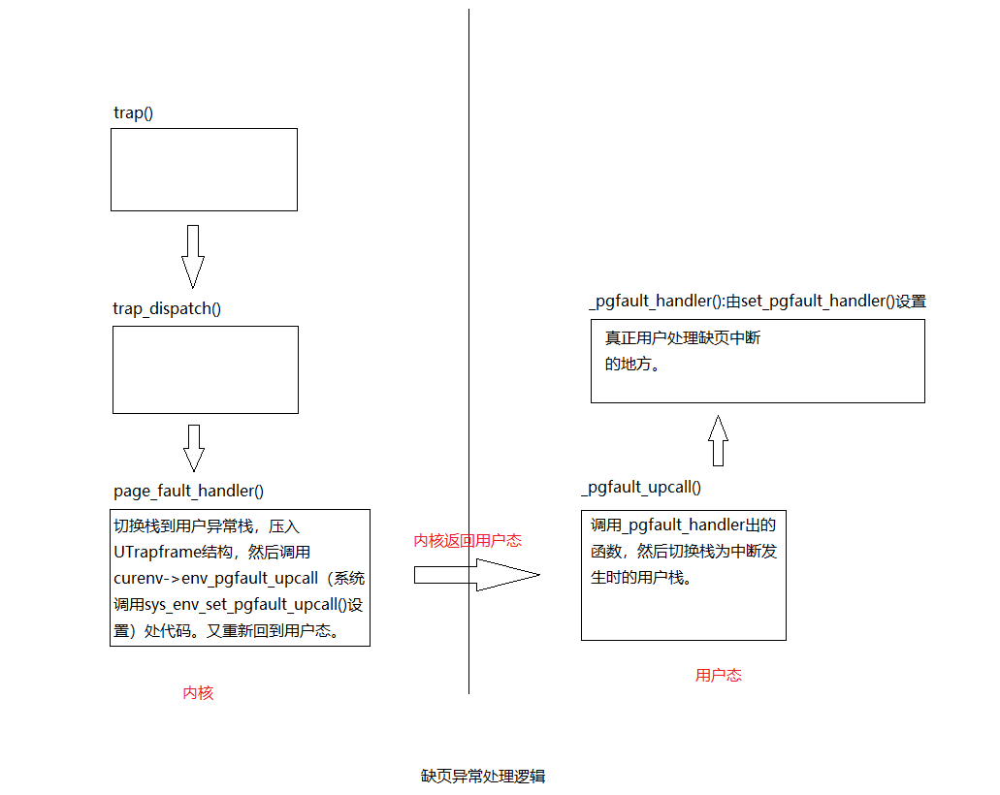

# Report for lab4

Hongyu Wen, 1800013069

> All exercises finished.
>
> All questions answered.
>
> Challenge 2 completed.

## Grade

```shell
dumbfork: OK (1.4s) 
Part A score: 5/5

faultread: OK (1.1s) 
faultwrite: OK (1.5s) 
faultdie: OK (2.5s) 
faultregs: OK (1.7s) 
faultalloc: OK (2.4s) 
faultallocbad: OK (1.4s) 
faultnostack: OK (2.6s) 
faultbadhandler: OK (1.4s) 
faultevilhandler: OK (1.5s) 
forktree: OK (1.7s) 
Part B score: 50/50

spin: OK (1.9s) 
stresssched: OK (2.7s) 
sendpage: OK (1.4s) 
pingpong: OK (1.8s) 
primes: OK (4.1s) 
Part C score: 25/25

Score: 80/80
```


## Part A: Multiprocessor Support and Cooperative Multitasking

### Exercise 1

```c
void *
mmio_map_region(physaddr_t pa, size_t size)
{
        ...
	physaddr_t head = ROUNDDOWN(pa, PGSIZE);
	physaddr_t tail = ROUNDUP(pa + size, PGSIZE); 
	// Note that the physical page need to be aligned
	
	size_t len = (size_t)(tail - head);
	if (base + len > MMIOLIM) {
		panic("mmio_map_region overflowed");
	}

	boot_map_region(kern_pgdir, base, len,  head, PTE_PCD | PTE_PWT | PTE_W);
	base += len;

	return (void*) (base - len);
	/* panic("mmio_map_region not implemented"); */
}
```
### Exercise 2

> Following a power-up or reset, the APs complete a minimal self-configuration, then wait for a startup signal (a SIPI message) from the BSP processor. Upon receiving a SIPI message, an AP executes the BIOS AP configuration code, which ends with the AP being placed in halt state.

In `page_init`:
```c
	for (i = 0; i < npages; i++) {
		if (i == MPENTRY_PADDR / PGSIZE)
			continue; // Can not use MPENTRY_PADDR
		...
	}

```

Now we get
```shell
check_page_free_list() succeeded!
check_page_alloc() succeeded!
check_page() succeeded!
```

### Question

1. In `boot.S`:
```asm
  # Jump to next instruction, but in 32-bit code segment.
  # Switches processor into 32-bit mode.
  ljmp    $PROT_MODE_CSEG, $protcseg
```
Now CPU is under real-mode so it can jump to a physical address directly. But in `mpentry.S`, the BSP has already be in protected-mode thus we need to calculate the physical address by `MPBOOTPHYS`. I guess
```
	# Call mp_main().  (Exercise for the reader: why the indirect call?)
	movl    $mp_main, %eax
	call    *%eax
```
that is the same reason.

### Exercise 3

```c
        uintptr_t base = KERNBASE - KSTKSIZE;
	for (int i = 0; i < NCPU; ++i) {
		boot_map_region(kern_pgdir, base, KSTKSIZE, PADDR(percpu_kstacks[i]), PTE_W);
		base -= KSTKSIZE + KSTKGAP;
	}
```

### Exercise 4

```
	int cid = cpunum();
	thiscpu->cpu_ts.ts_esp0 = KSTACKTOP - cid * (KSTKSIZE + KSTKGAP);
	// Note the new stack top
	
	thiscpu->cpu_ts.ts_ss0 = GD_KD;
	thiscpu->cpu_ts.ts_iomb = sizeof(struct Taskstate);

	// Initialize the TSS slot of the gdt.
	gdt[(GD_TSS0 >> 3) + cid] = SEG16(STS_T32A, (uint32_t) (&thiscpu->cpu_ts),
					sizeof(struct Taskstate) - 1, 0);
	gdt[(GD_TSS0 >> 3) + cid].sd_s = 0;

	// Load the TSS selector (like other segment selectors, the
	// bottom three bits are special; we leave them 0)
	ltr(GD_TSS0 + (cid << 3));
	// Note " + (cid << 3)"

	// Load the IDT
	lidt(&idt_pd);
```

`make qemu CPUS=4` and we get:
```shell
SMP: CPU 0 found 4 CPU(s)
enabled interrupts: 1 2
SMP: CPU 1 starting
SMP: CPU 2 starting
SMP: CPU 3 starting
```

### Questions

2. We cannot guarantee the contents in shared stack are right when we switch one cpu to another.


### Exercise 5

Just do as the exercise says.

### Exercise 6

```c
	int cur = 0;
	if (curenv) {
		cur = curenv->env_id;
	}
	for (int i = 0; i < NENV; ++i) {
		cur = (cur + 1) % NENV;
		if (envs[cur].env_status == ENV_RUNNABLE) {
			env_run(envs + cur);
		}
	}
	if (curenv && curenv->env_status == ENV_RUNNING)
		env_run(curenv);

	// sched_halt never returns
	sched_halt();
```

`make qemu CPUS=2` and we get:
```shell
Hello, I am environment 00001001.
Hello, I am environment 00001002.
Back in environment 00001001, iteration 0.
Hello, I am environment 00001000.
Back in environment 00001002, iteration 0.
Back in environment 00001001, iteration 1.
Back in environment 00001000, iteration 0.
Back in environment 00001002, iteration 1.
Back in environment 00001001, iteration 2.
Back in environment 00001000, iteration 1.
Back in environment 00001002, iteration 2.
Back in environment 00001001, iteration 3.
Back in environment 00001000, iteration 2.
Back in environment 00001002, iteration 3.
Back in environment 00001001, iteration 4.
Back in environment 00001000, iteration 3.
All done in environment 00001001.
```

### Questions

3. Because it is in kernel address.
4. In `env.c`: `env_pop_tf(&curenv->env_tf);`

### Exercise 7

```c
static envid_t
sys_exofork(void)
{
	struct Env * e;
	int r = env_alloc(&e, curenv->env_id);
	if (r < 0) return r; // Errors

	e->env_tf = curenv->env_tf;
	e->env_status = ENV_NOT_RUNNABLE;

	e->env_tf.tf_regs.reg_eax = 0;
	// sys_exofork will appear to return 0 in child env.
	return e->env_id;
}
```

```c
static int
sys_env_set_status(envid_t envid, int status)
{
	struct Env * e;
	int r = envid2env(envid, &e, 1);
	if (r) return r;
	if (status != ENV_RUNNABLE && status != ENV_NOT_RUNNABLE) {
		return -E_INVAL;
		// check for legal status
	}

	e->env_status = status;
	return 0;
}
```

```c
static int
sys_page_alloc(envid_t envid, void *va, int perm)
{
	struct Env * e;
	int r = envid2env(envid, &e, 1);
	if (r) return r;

	bool check1 = ((perm & (PTE_U | PTE_P)) == (PTE_U | PTE_P));
	bool check2 = ((perm & (~PTE_SYSCALL)) == 0);
	bool check3 = (va == ROUNDDOWN(va, PGSIZE));
	if (va >= (void*)UTOP || !check1 || !check2 || !check3) {
		return -E_INVAL;
		// Invalid parameters
	}

	struct PageInfo * p = page_alloc(1); // init to zero
	if (p == NULL) return -E_NO_MEM; // No enough memory

	r = page_insert(e->env_pgdir, p, va, perm);
	if (r) {
		page_free(p);
		// fail to insert the page and free the page
		return r;
	}

	return 0;
	/* panic("sys_page_alloc not implemented"); */
}
```

```c
static int
sys_page_map(envid_t srcenvid, void *srcva,
	     envid_t dstenvid, void *dstva, int perm)
{
	int r;
	struct Env *src, *dst;

	r = envid2env(srcenvid, &src, 1);
	if (r) return r;
	r = envid2env(dstenvid, &dst, 1);
	if (r) return r;

	if (srcva >= (void *)UTOP || srcva != ROUNDDOWN(srcva, PGSIZE)) return -E_INVAL;
	if (dstva >= (void *)UTOP || dstva != ROUNDDOWN(dstva, PGSIZE)) return -E_INVAL;
	bool check1 = ((perm & (PTE_U | PTE_P)) == (PTE_U | PTE_P));
	bool check2 = ((perm & (~PTE_SYSCALL)) == 0);
	if (!check1 || !check2) return -E_INVAL;

	pte_t *pte;
	struct PageInfo *p = page_lookup(src->env_pgdir, srcva, &pte);
	if (!p) return -E_INVAL;
	if (!(*pte & PTE_W) && (perm & PTE_W)) return -E_INVAL;

	r = page_insert(dst->env_pgdir, p, dstva, perm);
	// Just another reference to the page
	if (r) return r;
	return 0;
}
```

```c
static int
sys_page_unmap(envid_t envid, void *va)
{
	int r;
	struct Env *e;
	r = envid2env(envid, &e, 1);
	if (r) return r;
	if (va >= (void *)UTOP || va != ROUNDDOWN(va, PGSIZE)) return -E_INVAL;

	page_remove(e->env_pgdir, va);
	return 0;
}
```

After all, we have

```shell
dumbfork: OK (1.2s) 
Part A score: 5/5
```

## Part B: Copy-on-Write Fork

In `dumbfork.c`:
```c
void
duppage(envid_t dstenv, void *addr)
{
	int r;
	if ((r = sys_page_alloc(dstenv, addr, PTE_P|PTE_U|PTE_W)) < 0)
		panic("sys_page_alloc: %e", r);
	// allocate new page for child env
	
	if ((r = sys_page_map(dstenv, addr, 0, UTEMP, PTE_P|PTE_U|PTE_W)) < 0)
		panic("sys_page_map: %e", r);
	// map parent env virtual page(UTEMP) to the page

	memmove(UTEMP, addr, PGSIZE);
	// modify the page

	if ((r = sys_page_unmap(0, UTEMP)) < 0)
		panic("sys_page_unmap: %e", r);
	// Unmap the page
}
```


### Exercise 8


```c
static int
sys_env_set_pgfault_upcall(envid_t envid, void *func)
{
	struct Env * e;
	int r = envid2env(envid, &e, 1);
	if (r) return r;

	e->env_pgfault_upcall = func; 
	return 0;
}
```

### Exercise 9

```c
	if (curenv->env_pgfault_upcall) {
		uintptr_t stacktop = UXSTACKTOP;
		if (UXSTACKTOP - PGSIZE <= tf->tf_esp && tf->tf_esp < UXSTACKTOP) {
			// [UXSTACKTOP - PGSIZE, UXSTACKTOP ) is the user exception stack
			// Already in user exception stack: handler raise fault
			stacktop = tf->tf_esp;
		}
		uint32_t size = sizeof(struct UTrapframe) + sizeof(uint32_t);
		// Push a UTrapframe
		// Push one word of blank for convenience

		user_mem_assert(curenv, (void *)stacktop - size, size, PTE_U | PTE_W);
		struct UTrapframe utf = (struct UTrapframe *)(stacktop - size);

		utf->utf_fault_va = fault_va;
		utf->utf_err = tf->tf_err;
		utf->utf_regs = tf->tf_regs;
		utf->utf_eip = tf->tf_eip;
		utf->utf_eflags = tf->tf_eflags;
		utf->utf_esp = tf->tf_esp;

		curenv->env_tf.tf_eip = (uintptr_t)curenv->env_pgfault_upcall;
		curenv->env_tf.tf_esp = (uintptr_t)utf;
		env_run(curenv);
	}
```

### Exercise 10

```asm
	// LAB 4: Your code here.
	addl $8, %esp        // ignore utf_fault_va and utf_err
	movl 40(%esp), %eax  // move utf_esp to eax (esp when interrupt occured)
	movl 32(%esp), %ecx  // move utf_eip to ecx (eip when interrupt occured)
	movl %ecx, -4(%eax)  // push utf_eip to user stack

	// Restore the trap-time registers.  After you do this, you
	// can no longer modify any general-purpose registers.
	// LAB 4: Your code here.

	popal                // restore all registers
	addl $4, %esp        // ignore utf_eip

	// Restore eflags from the stack.  After you do this, you can
	// no longer use arithmetic operations or anything else that
	// modifies eflags.
	// LAB 4: Your code here.

	popfl                // restore eflags

	// Switch back to the adjusted trap-time stack.
	// LAB 4: Your code here.

	popl %esp           // Now %esp = utf_esp
	                    // Note that (%esp + 4) is utf_eip, use ret back to it

	// Return to re-execute the instruction that faulted.
	// LAB 4: Your code here.

	lea -4(%esp), %esp  // correct the value of %esp (we push utf_eip before)
	ret                 // back to utf_eip
```

### Exercise 11

```c
	if (_pgfault_handler == 0) {
		// First time through!
		// LAB 4: Your code here.
		/* panic("set_pgfault_handler not implemented"); */

		int r = sys_page_alloc(0, (void *)(UXSTACKTOP - PGSIZE), PTE_W | PTE_U | PTE_P);
		if (r < 0) {
			panic("set_pgfault_handler: alloc user exception stack failed");
		}
		/* cprintf("set here\n"); */
		sys_env_set_pgfault_upcall(0, _pgfault_upcall);
	}
```

Test and we get:

```shell
dumbfork: OK (1.7s) 
Part A score: 5/5

faultread: OK (1.0s) 
faultwrite: OK (1.5s) 
faultdie: OK (1.5s) 
    (Old jos.out.faultdie failure log removed)
faultregs: OK (1.5s) 
    (Old jos.out.faultregs failure log removed)
faultalloc: OK (2.1s) 
faultallocbad: OK (2.5s) 
faultnostack: OK (1.5s) 
faultbadhandler: OK (1.9s) 
faultevilhandler: OK (1.6s) 
```



### Exercise 12

```c
static void
pgfault(struct UTrapframe *utf)
{
	void *addr = (void *) utf->utf_fault_va;
	uint32_t err = utf->utf_err;
	int r;

	// Check that the faulting access was (1) a write, and (2) to a
	// copy-on-write page.  If not, panic.
	// Hint:
	//   Use the read-only page table mappings at uvpt
	//   (see <inc/memlayout.h>).

	// LAB 4: Your code here.

	bool check1 = (err & FEC_WR); // Caused by a write
	bool check2 = (uvpt[PGNUM(addr)] & PTE_COW); // Copy on write
	if (!check1 || !check2) {
		panic("pgfault: not copy on write");
	}

	// Allocate a new page, map it at a temporary location (PFTEMP),
	// copy the data from the old page to the new page, then move the new
	// page to the old page's address.
	// Hint:
	//   You should make three system calls.

	// LAB 4: Your code here.

	// Similar to dumbfork
	addr = ROUNDDOWN(addr, PGSIZE);
	if ((r = sys_page_map(0, addr, 0, PFTEMP, PTE_U | PTE_P)) < 0) // temp = addr
		panic("pgfault: sys_page_map failed");
	if ((r = sys_page_alloc(0, addr, PTE_U | PTE_P | PTE_W)) < 0)  // addr = new()
		panic("pgfault: sys_page_alloc failed");
	memmove(addr, PFTEMP, PGSIZE); // addr = temp
	if ((r = sys_page_unmap(0, PFTEMP)) < 0) // temp = 0
		panic("pgfault: sys_page_unmap failed");
	/* panic("pgfault not implemented"); */
}
```

```c
static int
duppage(envid_t envid, unsigned pn)
{
	int r;

	// LAB 4: Your code here.
	void *addr = (void *) (pn * PGSIZE);
	if (uvpt[pn] & PTE_SHARE) { // shared page
		if ((r = sys_page_map(0, addr, envid, addr, PTE_SYSCALL)) < 0)
			panic("sys_page_map: %e", r);
	} else if ((uvpt[pn] & PTE_W) || (uvpt[pn] & PTE_COW)) {
		if ((r = sys_page_map(0, addr, envid, addr, PTE_COW | PTE_U | PTE_P)) < 0)
			panic("sys_page_map: %e", r);
		if ((r = sys_page_map(0, addr, 0, addr, PTE_COW | PTE_U | PTE_P)) < 0)
			panic("sys_page_map: %e", r);

	} else { // read-only page
		if ((r = sys_page_map(0, addr, envid, addr, PTE_U | PTE_P)) < 0)
			panic("sys_page_map: %e", r);
	}
	return 0;
}
```

```c
envid_t
fork(void)
{
	// LAB 4: Your code here.
	/* panic("fork not implemented"); */

	extern void _pgfault_upcall(void);
	set_pgfault_handler(pgfault);

	envid_t envid = sys_exofork();
	if (envid == 0) {
		// child env
		// similar to dumbfork
		thisenv = &envs[ENVX(sys_getenvid())];
		return 0;
	} else if (envid < 0) {
		panic("sys_exofork: %e", envid);
	}

	for (uint32_t addr = 0; addr < USTACKTOP; addr += PGSIZE) {
		if (!(uvpd[PDX(addr)] & PTE_P)) continue;
		pte_t pte = uvpt[PGNUM(addr)];
		if ((pte & PTE_P) && (pte & PTE_U)) {
			duppage(envid, PGNUM(addr));
		}
	}

	int r;
	if ((r = sys_page_alloc(envid, (void *)(UXSTACKTOP-PGSIZE), PTE_P | PTE_W | PTE_U)) < 0)
		panic("sys_page_alloc: %e", r);
	// Need to allocate stack manually because the child env copy all the things from father
	if ((r = sys_env_set_pgfault_upcall(envid, _pgfault_upcall)) < 0)
		panic("sys_env_set_pgfault_upcall: %e", r);
	if ((r = sys_env_set_status(envid, ENV_RUNNABLE)) < 0)
		panic("sys_env_set_status: %e", r);
	return envid;
}
```

`make grade`:

```shell
faultread: OK (1.0s) 
faultwrite: OK (1.5s) 
faultdie: OK (1.2s) 
faultregs: OK (1.5s) 
faultalloc: OK (2.1s) 
faultallocbad: OK (2.5s) 
faultnostack: OK (1.5s) 
faultbadhandler: OK (1.9s) 
faultevilhandler: OK (2.4s) 
forktree: OK (1.5s) 
    (Old jos.out.forktree failure log removed)
Part B score: 50/50
```

## Part C: Preemptive Multitasking and Inter-Process communication (IPC)

### Exercise 13

In `trapentry.S`:
```asm
	.data
	.space 48

	.text
	NOEC(T_ExInt_32_handler, 32)
	NOEC(T_ExInt_33_handler, 33)
	NOEC(T_ExInt_34_handler, 34)
	NOEC(T_ExInt_35_handler, 35)
	NOEC(T_ExInt_36_handler, 36)
	NOEC(T_ExInt_37_handler, 37)
	NOEC(T_ExInt_38_handler, 38)
	NOEC(T_ExInt_39_handler, 39)
	NOEC(T_ExInt_40_handler, 40)
	NOEC(T_ExInt_41_handler, 41)
	NOEC(T_ExInt_42_handler, 42)
	NOEC(T_ExInt_43_handler, 43)
	NOEC(T_ExInt_44_handler, 44)
	NOEC(T_ExInt_45_handler, 45)
	NOEC(T_ExInt_46_handler, 46)
	NOEC(T_ExInt_47_handler, 47)
	NOEC(T_SYSCALL_handler, T_SYSCALL)
```

In `trap.c`:
```c
	for (int i = 32; i < 48; ++i) {
		// external interrupts
		SETGATE(idt[i], 0, GD_KT, funcs[i], 0);
	}
```

In `env_alloc`:
```c
	// Enable interrupts while in user mode.
	// LAB 4: Your code here.
	e->env_tf.tf_eflags |= FL_IF;
```

And then uncomment the `sti` instruction in `sched_halt()` so that idle CPUs unmask interrupts. When we run `make run-spin`, the kernel will print trap frames.


### Exercise 14

```c
	if (tf->tf_trapno == IRQ_OFFSET + IRQ_TIMER) {
		lapic_eoi(); // should first call lapic_eoi() to ACKNOWLEDGE interupt
		sched_yield();
	}
```

Then run `make run-spin` and we get:

```shell
[00000000] new env 00001000
I am the parent.  Forking the child...
[00001000] new env 00001001
I am the parent.  Running the child...
I am the child.  Spinning...
I am the parent.  Killing the child...
[00001000] destroying 00001001
```

### Exercise 15

```c
int32_t
ipc_recv(envid_t *from_env_store, void *pg, int *perm_store)
{
	// LAB 4: Your code here.
	/* panic("ipc_recv not implemented"); */

	if (pg == NULL) {
		// Not ask for a page
		pg = (void *)UTOP;
	}

	int r = sys_ipc_recv(pg);
	if (r < 0) {
		if (from_env_store) *from_env_store = 0;
		if (perm_store) *perm_store = 0;
		return r;
	}

	if (from_env_store) *from_env_store = thisenv->env_ipc_from;
	if (perm_store) *perm_store = thisenv->env_ipc_perm;
	return thisenv->env_ipc_value;
}
```

```c
void
ipc_send(envid_t to_env, uint32_t val, void *pg, int perm)
{
	// LAB 4: Your code here.
	/* panic("ipc_send not implemented"); */

	if (pg == NULL) {
		pg = (void *)UTOP;
	}

	while (true) {
		int r = sys_ipc_try_send(to_env, val, pg, (unsigned)perm);
		if (r) {
			if (r == -E_IPC_NOT_RECV) {
				sys_yield();
				// To be CPU-friendly
				// It's ok if dont call sys_yield() because of timer interrupts
				// primes: 6.1s -> primes: 4.1s
				continue;
			}
			panic("ipc_try_send: %e", r);
		} else {
			break;
		}
	}
}
```

```c
static int
sys_ipc_try_send(envid_t envid, uint32_t value, void *srcva, unsigned perm)
{
	// LAB 4: Your code here.
	/* panic("sys_ipc_try_send not implemented"); */

	int r;
	struct Env *e;

	r = envid2env(envid, &e, 0);
	if (r) return r;
	if (!e->env_ipc_recving) {
		return -E_IPC_NOT_RECV;
	}


	if (srcva < (void *)UTOP) {
		pte_t *pte;
		struct PageInfo *p = page_lookup(curenv->env_pgdir, srcva, &pte);

		bool check1 = ((perm & (PTE_U | PTE_P)) == (PTE_U | PTE_P));
		bool check2 = ((perm & (~PTE_SYSCALL)) == 0);
		bool check3 = (srcva == ROUNDDOWN(srcva, PGSIZE));
		if (!check1 || !check2 || !check3) return -E_INVAL;
		if (!p) return -E_INVAL; // srcva is not mapped in the caller's	address space.
		if ((perm & PTE_W) && !(*pte & PTE_W)) return -E_INVAL;

		void *dstva = e->env_ipc_dstva;
		if (dstva < (void *)UTOP) { // Otherwise no error occurs.
			r = page_insert(e->env_pgdir, p, dstva, perm);
			if (r) return r;
			e->env_ipc_perm = perm;
		}
	}

	e->env_ipc_recving = 0;
	e->env_ipc_from = curenv->env_id;
	e->env_ipc_value = value;
	e->env_status = ENV_RUNNABLE;
	e->env_tf.tf_regs.reg_eax = 0;
	// Hint:  does the sys_ipc_recv function ever actually return?
	// Answer: No. sys_ipc_recv will call sys_yield(). But when status = ENV_RUNNABLE, system will run the code of the env after call of sys_ipc_recv() at some time. So we need to set %eax.
	return 0;
}
```

```c
static int
sys_ipc_recv(void *dstva)
{
	// LAB 4: Your code here.
	/* panic("sys_ipc_recv not implemented"); */
	if (dstva < (void *)UTOP && ROUNDDOWN(dstva, PGSIZE) != dstva) {
		return -E_INVAL;
	}

	curenv->env_ipc_recving = true;
	curenv->env_ipc_dstva = dstva;
	curenv->env_status = ENV_NOT_RUNNABLE;
	sys_yield();

	return 0;
}
```

```shell
dumbfork: OK (1.4s) 
Part A score: 5/5

faultread: OK (1.1s) 
faultwrite: OK (1.5s) 
faultdie: OK (2.5s) 
faultregs: OK (1.7s) 
faultalloc: OK (2.4s) 
faultallocbad: OK (1.4s) 
faultnostack: OK (2.6s) 
faultbadhandler: OK (1.4s) 
faultevilhandler: OK (1.5s) 
forktree: OK (1.7s) 
Part B score: 50/50

spin: OK (1.9s) 
stresssched: OK (2.7s) 
sendpage: OK (1.4s) 
pingpong: OK (1.8s) 
primes: OK (4.1s) 
Part C score: 25/25

Score: 80/80
```